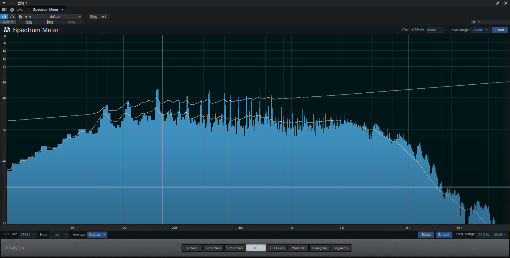
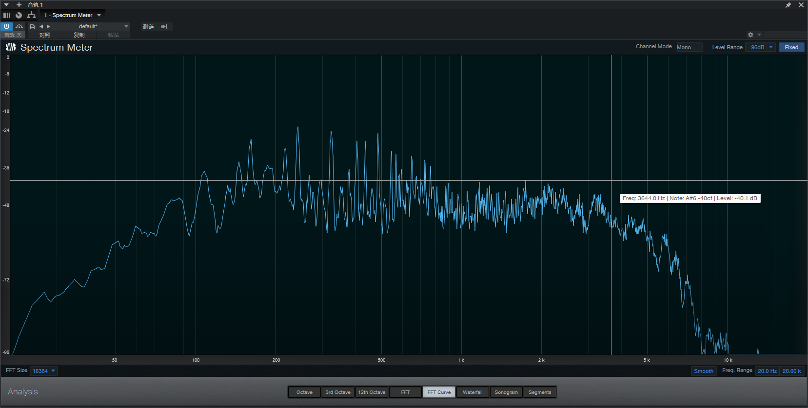
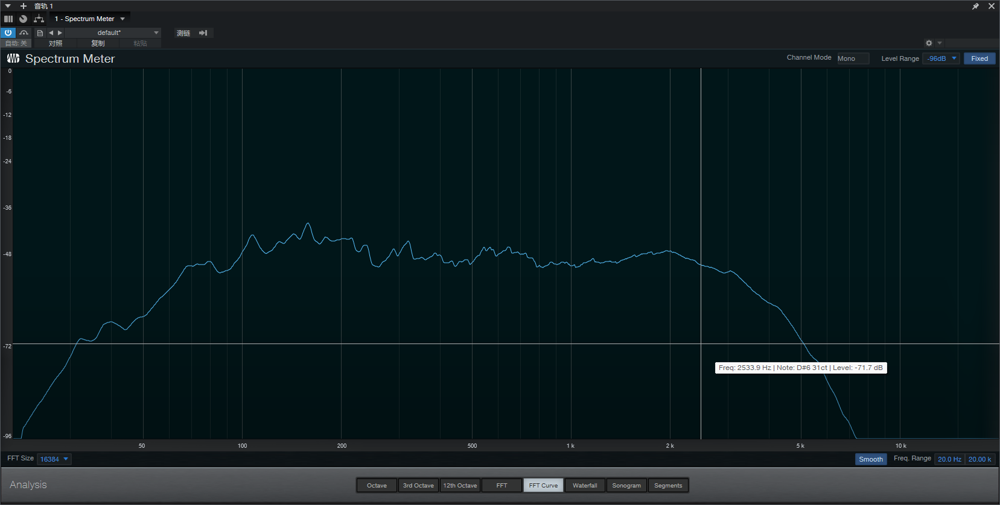
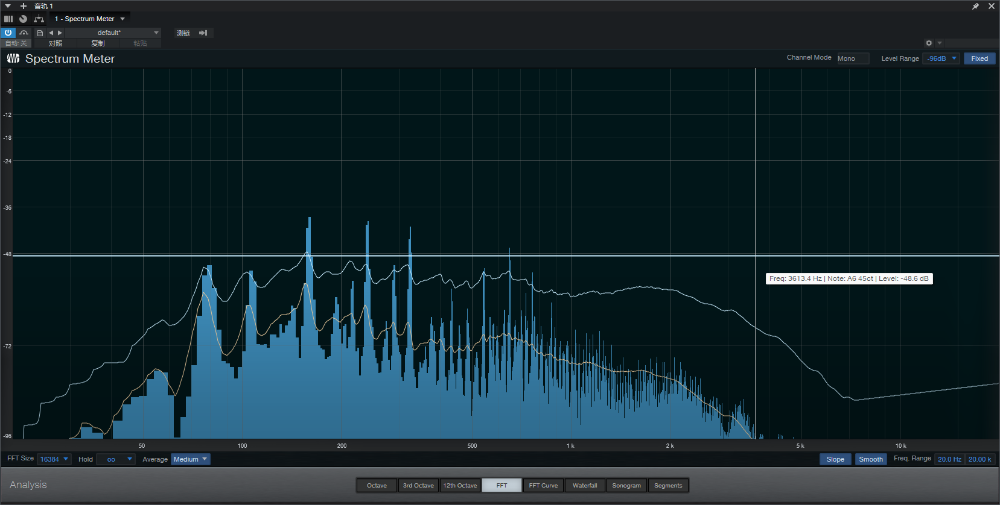

# 使用Studio One的频谱仪

## FFT
---
在记录到时域信号后，频谱仪会对时域信号进行**快速傅里叶变换**获得它的**频域曲线（FFT Curve）**
- 对于一个周期性的信号波形，总能认为它是由多个频率、幅值、相位不同的正弦/余弦波的线性组合
- 通过快速傅里叶变换可以得到一个**频率响应曲线**，描述这个时域信号中**不同频率的波形所占的比例**

对于乐器而言，弹奏某个单音（如440Hz的A4），获取其频响曲线，会发现主要的频率组成（在频域曲线中表现为突出的尖峰）包括其基音（440Hz）和泛音/谐波（440Hz的正整数倍频率，如880Hz-一次泛音、1320Hz-二次泛音等），基音和不同频率的泛音的组成比例决定了乐器的音色

## Level Range
---
对于数字音频常用的dbFS基准，要根据事先设定好的采样精度来设置量程（当前采样精度下的）才能得到正确的频响曲线

FFT处理后的频域曲线实际上是从一条从某个Level为负分贝（基于dBFS基准）的“**有效电平线**”（在采样精度是16bit的情况下，这个值就是-96dB）的横线开始拟合的，当记录到的信号波形幅值大于这个**有效电平线**时，才会被频谱仪视作有效信号并进行处理

### 改变Level 
修改Level Range后，实际上也会改变上述这条“横线”的位置，在改变Level Range后，这条曲线因为还对应着原来的纵坐标会竖直平移一段距离，但是这个时候这条曲线**已经不再准确，需要舍弃了**

例如，当用频谱仪记录的动态范围较小（如-48db）时，往往得到的是一个峰值波动很小甚至接近于平直横线的不准确的频域曲线（因为此时的信号幅度还是基本小于测量的最小值），但此时的**有效电平线**是-48db

当将动态范围改大（如-144db）时，这段较为扁平的曲线会随之向上平移一段距离，但是这条曲线是在**8bit采样精度**下拟合出来的结果，不再适用
- 最直白的例子就是如果取消这条曲线的Peak Hold，然后重新记录的话，会得到一个更为陡峭的曲线

上图白色的曲线为在-48dB下获得的Peak Hold曲线，在将Level Range改为-144dB后，其形状明显有别于实时的黄色曲线，本质上是两条**在不同采样精度标准下获得的曲线**
- 从这条曲线也能看出，在低采样精度的标准下，信号的动态范围狭小，更多的细节得不到保留

## Peak Hold
---
因为时域信号本身也是在不断变化的（随时间衰减），FFT得到的频域曲线也是会随之变化的（随之衰减）

FFT Curve实际上是**实时的，会随时间衰减的**，经常出现记录到信号后还没来得及分析就已经衰减掉的情况，这时候就需要频谱仪的**峰值保持功能**（Peak Hold）

在关闭Smooth的情况下，Peak Hold实际上就是保持记录到的所有频域曲线的每个频段都取其最大值获得的**离散点**
- 在弹奏单音的情况下，Peak Hold的形状实际上就是FFT得到的最大频域曲线
- 在多次弹奏的情况下，Peak Hold会得到一条更为均衡的频域曲线

这个功能和Level Range是息息相关的，实际上，原始数据的记录就是从Level Range设定的**有效电平线**开始，高于这个线的信号幅值被记录下来（如果是Peak Hold则取最大值），从而获得一系列离散点——**每个频率下的最大电平**

一个经过Smooth处理过的弹奏A4单音的频域曲线，仍然可以看出有数个突出的尖峰
- 为了排除过载等效果器的影响，直接旁通了效果器进行信号采样，所以在-96dB的动态下幅值仍然不是很大
- 当然地，这几个尖峰的频段分别对应了A4的基音（440Hz）与其谐波（880Hz、1320Hz等）

## Smooth
---
Smooth和Slope会影响所有FFT Curve（包括Peak Hold曲线和Average曲线）

直接获得的FFT Curve，其实会比较尖锐而且有多个明显的尖峰，难以分析和查看，开启Smooth后会对其进行曲线平滑化处理，获得一个更易于辨识的曲线

没有开启Smooth的FFT Curve

开启Smooth的FFT Curve
## Slope
---
在电路系统中，由于电路特性经常会引入粉红噪音（pink-noise）
- 本质是在各频段下功率相同的噪音，上文提到过对于声音而言，每高3dB，声压级高1/根号2倍，而声功率正比于声压级平方，即声功率高2倍，对于粉红噪音的频响图，可以得知是一条斜率为-3dB/二倍频（也可以说-3dB/八度音）的曲线

在FFT得到的频响图中为了抵消粉红噪音的干扰，往往也要对曲线进行斜率的修正（+3dB/Oct）

维基中给出的粉红噪声近似功率图
- 其功率以10dB/Decade（10分贝每十倍频）衰减
- 也可以说成3dB/Octave（3分贝每二倍频）

开启Slope后的Peak Hold曲线，能明显发现超高频段的“有效电平”发生了倾斜