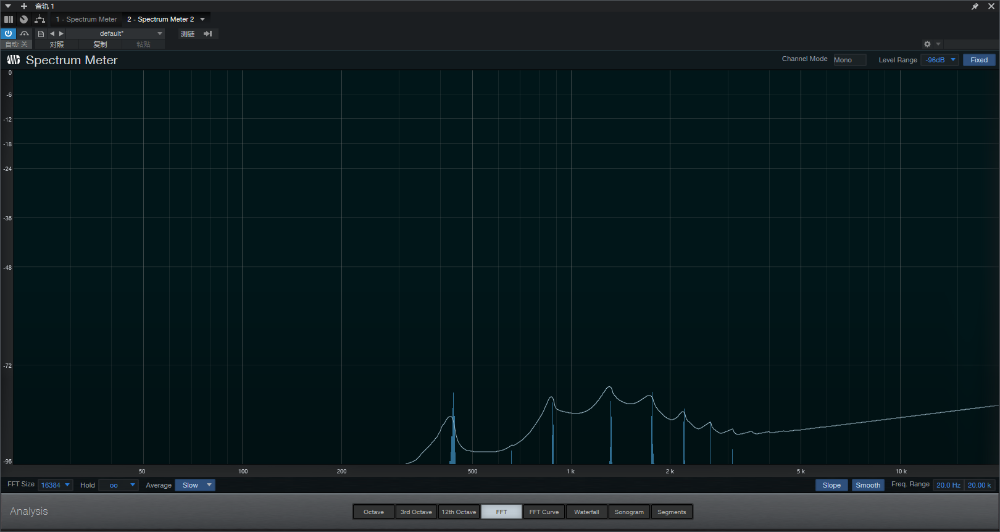
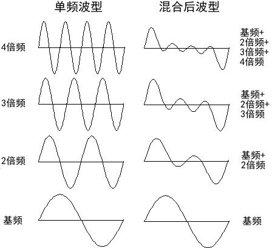
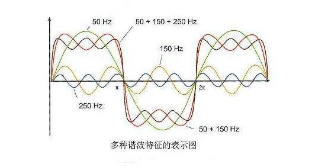
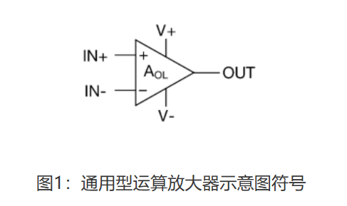

# 电路基础
## 阻抗
---
电吉他的系统是典型的**电压驱动的交流电电路**，虽然电吉他输出的是音频的模拟信号，但它仍然属于一种交流电源，只不过其交变特征携带着信息而已

我们在初中都已经学过，对于直流电路而言，电气元件对于电流的阻碍作用叫做**电阻**；而对于交流电而言，对于信号传输起阻碍作用的还有电路中的电抗，并分为**容抗**和**感抗**
- 我们在高中也学过，**感抗**是由于交流电其交变的特性，导致电路本身有阻碍其变化的趋势（即感生电动势），因为这是交流电本质的电路特性，这一点我们往往不作考虑
- **容抗**是由于电气元件自身带有的电容（就像内阻一样不可避免）对交流电的阻碍作用，一条导线（可能是吉他连接线，也可能是一个关闭后trueBypass的效果器）或多或少会由于金属屏蔽、线材长度等原因带有一定的电容

而**阻抗**实际上是电阻、电抗的向量和
- 因为电吉他中很少涉及相位的概念，也可以简单地认为是**阻抗=电阻+电抗=电阻+（容抗+感抗）**

## 分压电路
---
我们在初中也都学过，在电压驱动的串联电路中，用电器的电阻越大，其分到的电压就越多：

对于负载而言，我们往往希望负载(用电器)的阻抗即**输入阻抗**远大于电压源和导线阻抗（理想情况为无限大），这样才能在分压电路中使负载尽可能分到电压源的电压
- 尤其是对于信号系统而言，我们往往希望输入源能获取到完整的电平信号

对于电源而言，我们往往希望电源输出端的阻抗即**输出阻抗**远小于负载阻抗（理想情况为0），这样才能在分压电路中使电源尽可能少得分到电压源的电压（就像我们往往都希望电源内阻为0一样）
- 尤其是对于信号系统而言，我们往往希望输出源能输出完整的电平信号

我们都知道在电路中，“负载”和“电源”永远是一个相对的概念，我们可以把电压驱动的串联电路中的一个电阻和电源合并成一个新的内阻更大的**等效电源**来看待

换句话说，当我们看一个用电器的时候，我们希望这个用电器的阻抗是**无穷大**的，这样才能尽可能获得信号源的电平信号，而当这个用电器被我们使用完毕，轮到下一个用电器时，我们又希望这个用电器的阻抗是**零**，这样合并成一个新的等效电源时才能保证尽可能把新信号源输出的电平信号供给给下一个用电器
- 当然了，在我们高中以前的认知中，从左看和从右看的阻抗竟然是不一样的电子元件并不常见，这个需求常见于信号系统中，在其他情形的电路中并不多见
- 举个更形象的例子，当我们电吉他的信号输出出来，我们希望它进入的第一个过载效果器的阻抗**Z1**是无穷大的，这样由于分压电路的原理才能完整获得电吉他的信号，而这个效果器处理完毕，信号要进入下一个失真效果器时，我们又希望刚才那个过载效果器的阻抗**Z1**是零，或者这个失真效果器的阻抗**Z2**相较于**Z1**是无穷大，当然理由也是同理的；反过来说如果这个过载的输出阻抗和失真的输入阻抗是一样大的，由于分压原理就会导致输出信号有一半会损耗在这个过载效果器上

这样高进低出的连接叫做**阻抗匹配**的连接方式，阻抗不匹配的连接方式如10kΩ的高输出阻抗的电吉他直插10kΩ低输入阻抗的调音台（一个相对高阻抗输出和一个相对低阻抗输入）就会导致电吉他输出的信号至少有一半会损耗在导线和拾音器本身上，这时候我们就需要一个可以提供阻抗匹配功能的**DI盒（Direct Input Box）**来转接

要注意的输出阻抗和输入阻抗的高和低永远是相对而言的，我们说电吉他是高输出阻抗往往是相对于调音台这些相对较低的输入阻抗的设备，但是如果插效果器的话电吉他就属于低输出阻抗的合理范围了

有了上面这些基础知识，我们就可以引入正文了

# 线性失真
## 谐波失真
---
当我们在清音的情况下拨响电吉他上的标准音A时，对时域波形进行快速傅里叶变换得到频谱图，会发现我们得到的音频信号并非一个440hz的正弦波，而是一个**最低的基音是440hz，此外还包括多个440hz整数倍频率（880hz、1320hz等等...）的谐波**，对于任何能够发出声音的物体，**基音和不同谐波的组成比例**就是决定其音色的关键性因素
- 由于人耳的遮蔽效应，我们只能分辨出最低的**基音**，不论其谐波比例有多大，我们听到的仍然是一个440hz的标准音A，但是由于谐波比例的不同我们能够感知到不同的音色

当我们通过各种电气元件（滤波器、电容电感元件，均衡器等）修改这个声音的谐波组成比例时，就会导致声音的音色发生改变，偏离其原有音色，我们将其称为**谐波失真**，谐波失真分为**奇次谐波失真**和**偶次谐波失真**
- 频率是基音偶数倍的谐波叫做**偶次谐波**，对于440hz而言880hz就是偶次谐波，偶次谐波和基音的频率在音程上满足**纯五度-1.5倍**或者**纯八度-2倍**的关系，即和谐音程，所以听起来更给人以统一、温暖的感觉
- 频率是基音奇数倍的谐波叫做**奇数谐波**，对于440hz而言1320hz就是奇次谐波，奇次谐波和基音的频率在音程上往往不满足和谐音程，往往就跟人以尖锐、破碎、不和谐感

由这张谐波的叠加后波形可以发现，我们越往基音上叠加奇次谐波，最后得到的波形越接近于方波

换句话说，**失真效果器的音色就是通过削顶得到近似方波了增加了原有音色的奇次谐波，从而使音色变得更加尖锐、破碎**

而**电子管放大则会在信号中混入少量的偶次谐波，导致听感上更加温暖和谐**

## 容抗公式
--- 
给定一个电容，我们可以得到**容抗**的计算公式：
$$Z=\frac1{2πfc}$$
- f:交流电频率
    - 这里可以知道，电容是阻直流的，因为直流电可以认为其频率为0
- c:电容大小

我们希望导线电容和输出端对面的负载形成的并联电路其阻抗尽可能地高以**捕获**输出的信号，由上述的并联电路阻抗计算公式可知我们需要其电容尽可能地小，使其容抗尽可能大以增大这个并联电路的阻抗
- 此时这个电容的存在就像串联电路中的导线内阻一样讨厌
- 就像我们只考虑串联情况下的导线内阻一样，我们也只考虑并联情况下的导线电容，我们只分析会对信号传输造成阻碍的那部分因素

此外我们还能从容抗公式中发现另一个问题：电容的容抗是会随着信号电平频率而发生变化的

## 高频衰减
---
回顾上文提到的基音和谐波，对于电吉他输出的交流信号而言，它不是简简单单的一个频率唯一的正弦波，而是可以近似认为的**全频段信号**（大约覆盖20-20khz的范围），对于其时域波形实际上是无数个不同频率的波形线性组合得到的结果，而**导线电容对于不同频率的信号，其频率响应特性是不同的**

在交流电的并联电路中，阻抗仍然满足公式
$$Z=\frac1{\frac1{Z1}+\frac1{Z2}}$$

- 当信号频率增大时（可能单纯是一个很高的音，也有可能是一个音的高频谐波分量），即上述公式中f增大
- 这段导线相对于这个频率信号的容抗减小
- 由上述的并联电路的阻抗公式可知，并联电路的整体阻抗就会越小
- 由串联电路的分压原理可知，这一段并联电路整体的分压能力更差
- 对于这个**特定的高频信号**而言，输入端的信号衰减就会越严重

即导线电容对于信号的高频分量的衰减效应是大于低频分量的，**信号衰减对于中高频的信号分量要更加明显**，在频域图上看，其**频率响应曲线是随信号频率呈现下降趋势的**，而这种衰减效应还会随着导线电容的增加进一步加剧。
- 这也可以解释为什么当采用了劣质的线材或者线路过长（总之就是整个电路的导线内电容过大）的情况下，音色会从明亮转变为暗淡（中高频的谐波分量相对被更多的衰减导致低频分量更加突出）的原因
- 而当线材的质量比较好，采用了低电容的制作方式（更好的屏蔽层、传导率更高的线基等），这种线性失真的现象就相对不那么严重一些

# 运算放大器
运算放大器并非只在失真类的效果器中可以遇到，实际上许多效果器都会或多或少用到运放
- 压缩效果器（Compressor）常常用一个负反馈的运算放大器来实现
- 失真效果器（Distortion）的Gain和Volume旋钮实际上前者控制的是运算放大器的反馈电路，后者控制的是输出端后一个独立的变阻器，换句话说，Gain是拧的越大，信号增益得越大；Volume拧的越小，信号衰减得越大，这也是为什么Volume不会改变输出端信号的失真度的原因

## 运放原理
---

关于运算放大器的基础知识网上已经有很多了，这里不再赘述

理想的运算放大器有两个基本的特性：
- $V_{out}=((IN+)-(IN-))\times A且V{out}\leq Vcc$
- 对于输入电压相当于**短路（虚短）**，对于输入电流相当于**断路（虚断）**
    - **虚短**是因为这里的A是放大器的放大倍数，是代表放大器本身放大能力的固有参数，这个数值往往能达到100dB（即10万倍的放大倍率），但是实际上输出电压不会高于供电电压，为了保证公式平衡，(IN+)-(IN-)这个参数就会非常小甚至趋近于0
    - **虚断**是我们对于运放的期望，即希望它的输入阻抗的无穷大的，以捕获完整的信号

**虚短和虚断**的特性意味着运算放大器有着**高输入阻抗**和**低输出阻抗**的特性，回顾上文信号系统中**阻抗匹配**的需求，即便不考虑运算放大器的**放大功能**，运放的**高进低出**特性也是非常重要的

## Buffer电路
---
**Buffer电路**（缓冲门）可以近似认为是一个0增益（即无放大和衰减）的放大电路，或者说一个不改变信号强度的Booster，通过运放高进低出的阻抗特性可用于许多用途
- 实现阻抗匹配来连接原本输入阻抗相对较低的许多设备（DI盒原理）
- 也可用作**抵消Buffer之前部分的高阻抗对于之后部分的信号传输衰减的影响**（Buffer效果器原理）
    - 因为当我们把信号源和运放合并成一个新的等效信号源时，不论原来的信号源内阻抗有多少，新的信号源输出阻抗都会变成0，抵消了前面所有部分阻抗的影响

单独的一个Buffer电路模块我们也叫做**Buffer效果器**
- 在一个没有接入Buffer效果器的电路中，一个10kΩ的电吉他输出阻抗相对于1MΩ的输入阻抗已经足够小，但还不够完美，尤其是过长的吉他连接线，6m以上长度的线材很容易达到一个无法轻易忽视的阻抗，更别提开启trueBypass的效果器本身也是一段导线
- 当接入Buffer效果器后，从其输出端我们会获得一个强度和波形与原信号几乎一样的电平信号，但此时输出阻抗大大降低，大大增强了后续电路的负载能力

实际上大多数效果器本身都具有Buffer的能力，最直接的就是失真类效果器了，它们本身就是基于运放电路实现的，只不过Buffer效果器为了不改变原信号而不对信号进行增益而已

## 效果器旁通
---
这里算一些题外话了，既然提到了Buffer电路，那么就不可避免会让人想到trueByPass和bufferedBypass

大部分被动式拾音器的吉他都属于高阻抗输出的范畴，其输出阻抗约为**10-30kΩ**（主动式拾音器可以有更低的输出阻抗，这里不在讨论”范围中）

以Roland BOSS的SD-1过载效果器在官网放出的技术指标为例：
- SD-1的输入阻抗为1MΩ；输出阻抗为1kΩ
    - 当电吉他直插SD-1时，输入阻抗是输出阻抗的约100倍，那么只会有极少的信号因为拾音器和导线本身的阻抗而被衰减
    - 而当SD-1插入其他效果器时，输出阻抗只有1kΩ又能够保证输出信号不会有太多损耗在自己身上
- 这里还有一些其他有趣的指标
    - 建议负载阻抗说明了输出端对面的输入阻抗应当至少大于10kΩ
    - 旁通方式为bufferedBypass，实际上BOSS的大多数效果器都是bufferedByPass的

### Buffer旁通
当我们关闭效果器时，信号需要无视这个效果器继续往下行进，而效果器通常有两种旁通方式：
- **bufferedBypass**
    - 这种方式是信号继续通过放大电路达到输出端，但是不对信号进行增益，仅仅进行阻抗转换，此时的效果器在关闭后本身就相当于一个Buffer效果器
    - 优势是**抵消了导线线材导致的音色损耗**，但是运放电路本身的及其反馈电路的滤波特性会在一定程度上造成音染
- **trueBypass**
    - 我们都知道，trueByPass的效果器在关闭效果器后信号不经过放大电路，而是通过3PDT直通到输出端，此时效果器本身就相当于一段导线
    - 优势是**避免了效果器电路本身的音染**，在关闭效果器后几乎不对信号产生影响，但是会加剧因为线材长度而导致的线性失真问题

区分这两种旁通方式很简单，上面已经提到过运放的输出电平不会高于供电电压，把你的效果器电源拔掉，然后试着弹琴，trueByPass的效果器会被无视掉并正常传输信号；而bufferedByPass的效果器会把信号完全阻隔，无法继续传递到后续电路

总的来说，trueByPass和bufferedBypass实际上并没有孰优孰劣，是对于两种不同音色损耗来源的取舍方式，前者着重处理放大电路带来的音染但是加剧了线材带来的音色损耗，而后者着重处理线材带来的音色损耗但是加剧了电路带来的音染

为什么在大多数效果器都具有Buffer功能的情况下仍然有Buffer效果器的需求呢？

原因在于效果器并不一定是bufferedBypass的（它们仅在开启的时候有缓冲功能），也不一定是常开的。
- 如果你的矩阵喜欢把五六块失真类单块串在一起，然后通过不同组合的开和关来切换你的音色链，而这些单块还都是trueByPass的，这本质上相对于加长了你的线材长度并加剧了线材损耗（尤其是效果器内的直通电路的屏蔽性并不一定做的足够好），trueByPass的失真在开着的时候能起到buffer的作用，但是关了后它就什么也不是，所以就会有需求放一块常开的，始终能起作用的buffer效果器了